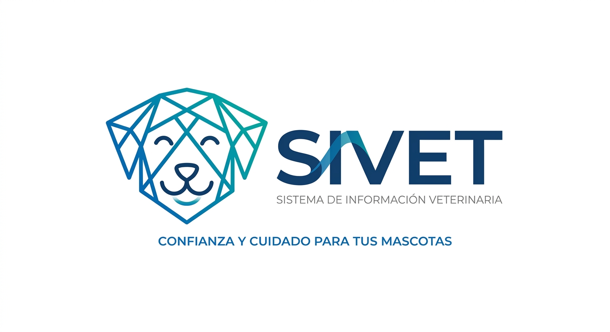

# SICVET - SISTEMA DE INFORMACIÓN VETERINARIA :dog:
## Sistema de informacion de  Citas veterinarias- Máscol-Colombia
---

  

---

## :warning: Planteamiento del Problema
Las clínicas veterinarias enfrentan continuamente dificultades en la gestión manual de citas, registro de pacientes, control de disponibilidad del personal médico y comunicación con los propietarios de mascotas. Muchos de estos procesos se realizan mediante llamadas telefónicas, agendas físicas o registros dispersos, lo que genera errores humanos, duplicidad de citas, pérdida de información y tiempos de respuesta elevados.

En consecuencia, los usuarios experimentan demoras en la atención, dificultades para hacer seguimiento a los servicios prestados, y falta de notificaciones oportunas. Por su parte, el personal administrativo presenta sobrecarga operativa al gestionar agendas, confirmar citas o reprogramarlas.

> **Nota:** La ausencia de un sistema informático centralizado limita la eficiencia del servicio, afecta la satisfacción del cliente y reduce la capacidad de la clínica para gestionar de manera organizada los flujos de atención. Por lo anterior, es necesario desarrollar una solución tecnológica que permita digitalizar y optimizar el proceso de agendamiento.

### :question: Pregunta Problema
¿Cómo el desarrollo de una aplicación web para el agendamiento de citas puede optimizar la gestión operativa y mejorar la atención al cliente en la veterinaria Máscol-Colombia?

---

## :rocket: Alcance y Delimitación del Proyecto
La implementación de esta aplicación web es una necesidad estratégica para modernizar la gestión de la clínica veterinaria **Máscol-Colombia**, sustituyendo los registros manuales por una plataforma digital y centralizada que garantiza la veracidad de la información y la eficiencia operativa.

### Puntos Clave:
* **Objetivo y Valor:** Mitigar el error humano (duplicidad de horarios o pérdida de datos) asegurando una "única fuente de verdad" accesible para recepcionistas y médicos.
* **Áreas Beneficiadas:** Recepción y cuerpo de médicos veterinarios.
* **Áreas No Beneficiadas:** Contabilidad y tesorería quedan fuera del alcance.
* **Tiempo y Escalabilidad:** Desarrollo en un periodo de **un año y medio** (proceso académico ADSO). El sistema es escalable para futuros requerimientos.

### :gear: Funcionalidades Principales:
1.  **Gestión de citas:** Organización de la agenda y asignación de horarios.
2.  **Registro de Clientes y Mascotas:** Base de datos digital de los usuarios.
3.  **Control de Citas:** Módulos para la confirmación y cancelación de servicios.
4.  **Gestión de Personal:** Control de acceso para los empleados de la clínica.

---

## :bulb: Justificación
La implementación de esta aplicación web es una necesidad estratégica para modernizar la gestión de la clínica, sustituyendo las limitaciones de los registros manuales por una plataforma centralizada que garantiza la integridad de los datos. Al ser una herramienta accesible en tiempo real, permite mitigar errores críticos como el cruce de horarios, optimizando la capacidad de respuesta del personal.

**Beneficios Integrales:**
* **Empleados:** Reducción de carga operativa.
* **Clientes:** Acceso a un servicio ágil, moderno y profesional.
* **Dirección:** Control total del negocio y arquitectura escalable que evoluciona con el sector veterinario.

---

## :dart: Objetivos

### Objetivo General
Desarrollar un sistema de información para el agendamiento de citas para la empresa **Máscol-Colombia**, que permita el agendamiento de citas y servicios.

### Objetivos Específicos
* **Diseño:** Crear una interfaz intuitiva para que el personal registre citas de manera ágil.
* **Validación:** Desarrollar un módulo de validación de horarios para eliminar cruces en tiempo real.
* **Almacenamiento:** Implementar una base de datos centralizada y segura para clientes, mascotas y personal.
* **Automatización:** Organizar la agenda según disponibilidad de personal y servicios.
* **Arquitectura:** Construir un software escalable para futuras integraciones.

---
*:computer: Desarrollado como parte del programa de formación ADSO - SENA.*
